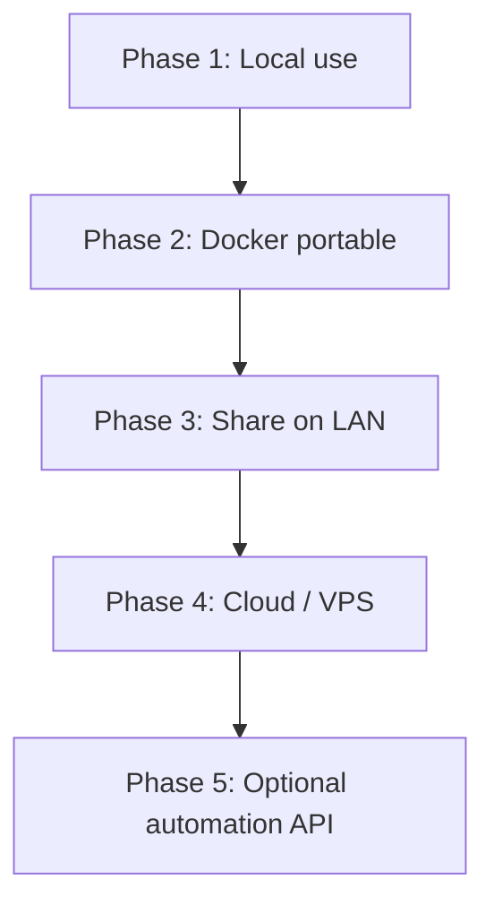

# Deployment Roadmap — Hindi Voice Generator

This guide explains how to run the app on other devices and scale it for your team or YouTube workflow.

## What You Have Today

| Mode | Best for | Internet needed |
|------|----------|-----------------|
| Local Python | Your current Windows PC | Yes (edge-tts) |
| Docker | Any PC/Mac/Linux with Docker | Yes (edge-tts) |
| Docker + LAN | Team on same Wi‑Fi/network | Yes (edge-tts) |
| Cloud VPS | Access from anywhere | Yes (edge-tts) |

The app uses **Microsoft neural Hindi voices** via `edge-tts`. No API key is required, but an internet connection is required on every device that generates audio.

---

## Roadmap Overview



### Phase 1 — Local use (done)
You already run this on Windows with Python + FFmpeg.

```powershell
streamlit run app.py
```

Use cases:
- Paste YouTube scripts and download WAV
- Batch CLI: `python generator.py --file script.txt`

---

### Phase 2 — Portable with Docker (recommended)

**Goal:** Run the same app on any laptop/PC without installing Python or FFmpeg manually.

### Prerequisites on the new device
1. Install [Docker Desktop](https://www.docker.com/products/docker-desktop/) (Windows/Mac) or Docker Engine (Linux)
2. Copy this project folder (or clone from Git)

### Build and run

```powershell
cd E:\TEXT_TO_VOICE_GENERATOR
docker compose up --build
```

Open: **http://localhost:8501**

Generated audio is saved to the local `output/` folder (mounted into the container).

### Stop the app

```powershell
docker compose down
```

### Move to another device

1. Copy the project folder to USB/cloud/Git
2. On the new machine: install Docker
3. Run `docker compose up --build`
4. No Python/FFmpeg setup needed on that machine

---

### Phase 3 — Share on your local network (team use)

Run Docker on one machine and let others on the same Wi‑Fi use it.

1. Start the container:

```powershell
docker compose up -d
```

2. Find host IP (Windows):

```powershell
ipconfig
```

Look for `IPv4 Address` (example: `192.168.1.25`).

3. On other devices (phone/laptop), open:

```
http://192.168.1.25:8501
```

**Security note:** This exposes the app on your LAN only. Do not port-forward to the public internet without authentication.

---

### Phase 4 — Cloud deployment (access from anywhere)

Deploy to a small VPS so you can generate voice from any location.

| Provider | Difficulty | Cost |
|----------|------------|------|
| DigitalOcean / Hetzner / AWS Lightsail | Medium | ~$5–10/month |
| Railway / Render | Easy | Free tier / low cost |

### Example: VPS with Docker

```bash
git clone <your-repo-url>
cd TEXT_TO_VOICE_GENERATOR
docker compose up -d --build
```

Open: `http://<server-ip>:8501`

Optional next steps for production:
- Put **Nginx** or **Caddy** in front with HTTPS
- Add basic auth (username/password)
- Restrict firewall to your IP only

---

### Phase 5 — Automation (future, optional)

If you want batch YouTube pipelines later:

| Approach | Use case |
|----------|----------|
| CLI in scripts | `python generator.py --file episode.txt -o ep01.wav` |
| Cron / Task Scheduler | Nightly batch generation |
| REST API wrapper | Integrate with n8n, Zapier, custom tools |

The current CLI (`generator.py`) is already automation-ready.

---

## Docker Commands Cheat Sheet

```powershell
# Build image
docker compose build

# Run in foreground
docker compose up

# Run in background
docker compose up -d

# View logs
docker compose logs -f

# Stop
docker compose down

# Rebuild after code changes
docker compose up --build -d
```

### CLI inside Docker (batch mode)

```powershell
docker compose run --rm hindi-voice python generator.py --file /app/output/script.txt -v hi-IN-MadhurNeural -o batch.wav
```

Place `script.txt` in your local `output/` folder first so the container can read it.

---

## Recommended Workflow for YouTube Creators

1. **Write script** in Notepad/Google Docs (Hindi)
2. **Save as** `script.txt` (UTF-8)
3. **Open app** → upload file or paste text
4. **Choose voice:** Swara (female) or Madhur (male)
5. **Export WAV** (48 kHz) for video editor
6. **Import** into CapCut / Premiere / DaVinci Resolve

### Batch multiple episodes

```powershell
python generator.py --file episode01.txt -v hi-IN-SwaraNeural -o ep01.wav
python generator.py --file episode02.txt -v hi-IN-SwaraNeural -o ep02.wav
```

---

## Device Portability Comparison

| Method | Portable? | Setup on new PC | Best for |
|--------|-----------|-----------------|----------|
| Python + venv | Medium | Install Python, FFmpeg, pip | Development |
| Docker | High | Install Docker only | Teams, multiple PCs |
| Git clone + Docker | High | `git clone` + `docker compose up` | Consistent deploy |
| Cloud VPS | Highest | Browser only | Remote access |

---

## Troubleshooting (Docker)

**Port 8501 already in use**
Change in `docker-compose.yml`:
```yaml
ports:
  - "8502:8501"
```
Then open `http://localhost:8502`.

**No audio generated**
- Check internet inside container (edge-tts needs outbound HTTPS)
- Ensure Hindi (Devanagari) text is in the input

**Output files missing**
- Files are written to `./output` on your host (volume mount)
- Check `output/` folder next to `docker-compose.yml`

---

## Next Steps (suggested order)

1. Test Docker locally: `docker compose up --build`
2. Share on LAN for your team (Phase 3)
3. Push repo to GitHub/GitLab for easy cloning
4. Deploy to a VPS when you need remote access
5. Add HTTPS + auth before exposing publicly
