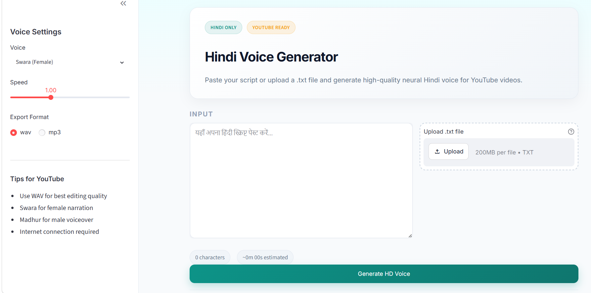

# Hindi Voice Generator

Convert Hindi text into high-quality neural voice audio for YouTube videos. Paste your script in the browser or upload a `.txt` file and export HD WAV or MP3.

## Features

- Hindi-only neural voices (Swara, Madhur)
- Paste text or upload `.txt` files
- YouTube-ready **48 kHz WAV** export
- Long-script support with automatic chunking
- Light, clean Streamlit UI

## Requirements

- Python 3.10+
- [FFmpeg](https://ffmpeg.org/) on PATH (required for audio merge/export)
- Internet connection (edge-tts uses Microsoft's online neural voices)

### Install FFmpeg (Windows)

```powershell
winget install ffmpeg
```

Verify:

```powershell
ffmpeg -version
```

## Setup

```powershell
cd E:\TEXT_TO_VOICE_GENERATOR
python -m venv .venv
.venv\Scripts\activate
pip install -r requirements.txt
copy .env.example .env
```

## Run the App

```powershell
streamlit run app.py
```

Open the URL shown in the terminal (usually `http://localhost:8501`).

## Docker (Portable)

Run on any machine with Docker installed — no Python or FFmpeg setup needed.

```powershell
docker compose up --build
```

Open: **http://localhost:8501**

Generated audio is saved to the local `output/` folder.

See **[DEPLOYMENT.md](DEPLOYMENT.md)** for the full portability roadmap (LAN sharing, cloud VPS, batch workflows).

## CLI Usage

```powershell
python generator.py "नमस्ते, यह एक परीक्षण है।" -v hi-IN-SwaraNeural -o test.wav
python generator.py --file script.txt -v hi-IN-MadhurNeural --format mp3
```

## Voices

| Voice | ID | Best for |
|-------|-----|----------|
| Swara (Female) | `hi-IN-SwaraNeural` | General narration |
| Madhur (Male) | `hi-IN-MadhurNeural` | Male voiceover |

## Output

Generated files are saved to the `output/` folder.

- **WAV** — recommended for YouTube editing (48 kHz, 16-bit)
- **MP3** — smaller file size (320 kbps)

## Optional Config

Copy `.env.example` to `.env` to customize defaults:

```
DEFAULT_VOICE=hi-IN-SwaraNeural
OUTPUT_FORMAT=wav
MAX_CHARS=50000
```

## Troubleshooting

**FFmpeg not found**
FFmpeg may be installed but not on PATH yet. Try:
1. Close and reopen your terminal
2. Or set `FFMPEG_PATH` in `.env` to your `ffmpeg.exe` path
3. WinGet install path example:
   `C:\Users\<you>\AppData\Local\Microsoft\WinGet\Packages\Gyan.FFmpeg_...\ffmpeg-9.0.1-full_build\bin\ffmpeg.exe`

**No Hindi text detected**
Ensure your script uses Devanagari (Hindi) characters.

**Slow generation for long scripts**
Long YouTube scripts are split into chunks and merged. This is normal for 5k+ character scripts.
