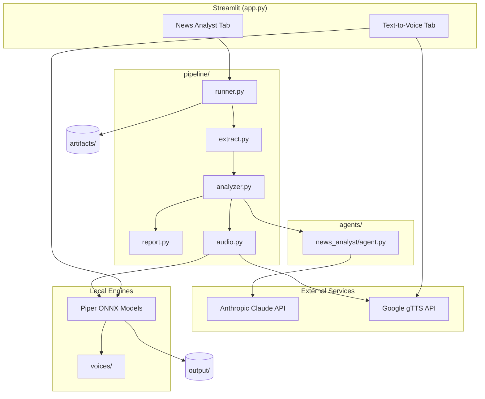

# System Overview

## Purpose

This application serves two related use cases:

1. **News Analyst** — Turn news articles (text or PDF) into exam-focused study material for Indian competitive exams (UPSC, SSC, Banking, State PSC). Outputs include structured analysis, a PDF report, and narrated audio.
2. **Text-to-Voice** — Convert arbitrary text to speech using offline Piper voices or online gTTS for Indian languages.

## Tech Stack

| Layer | Technology |
|-------|------------|
| UI | Streamlit |
| LLM | Anthropic Claude (`claude-sonnet-5` default) |
| Structured output | Anthropic SDK `messages.parse()` + Pydantic |
| TTS (English) | Piper ONNX (CPU, offline) |
| TTS (Hindi/Bhojpuri) | Google gTTS (online) |
| PDF input | PyMuPDF (`fitz`) |
| PDF output | ReportLab |
| Config | python-dotenv (`.env`) |

## High-Level Architecture



## User-Facing Features

### News Analyst Tab

| Feature | Detail |
|---------|--------|
| Input modes | Paste text or upload PDF |
| Exam focus | UPSC Prelims, UPSC Mains GS, SSC, Banking, State PSC |
| Voice options | 9 voices (5 English Piper, 4 Hindi/Bhojpuri gTTS) |
| Outputs | In-app preview, PDF download, audio download, JSON download |
| Job storage | Each run gets a unique `job_id` under `artifacts/` |

### Text-to-Voice Tab

| Feature | Detail |
|---------|--------|
| Input | Free-form text (max 5,000 chars) |
| Controls | Voice, speed (0.5–2.0), volume (0.1–2.0) |
| Output | In-browser audio player + download |

### CLI (optional)

```bash
python generator.py "Hello world" -v en_US-lessac-medium
```

## Non-Goals (current MVP)

- User authentication or multi-tenant storage
- Database persistence (filesystem only)
- Real-time news fetching / RSS ingestion
- Batch processing or job queues
