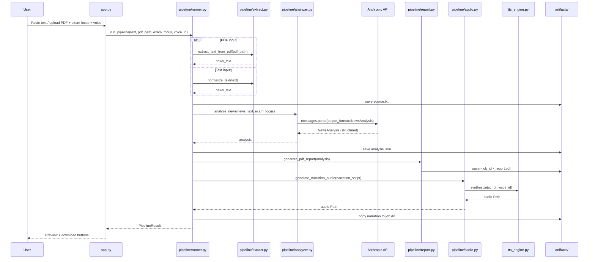

# Data Flow

## News Analyst Pipeline



## Stage Details

### 1. Extract (`pipeline/extract.py`)

| Input | Processing | Output |
|-------|------------|--------|
| PDF file | PyMuPDF page text, max 50 pages | Plain text string |
| Raw text | Strip whitespace, cap at 80,000 chars | Cleaned text |

Raises `ValueError` if PDF has no readable text or input is empty.

### 2. Analyze (`pipeline/analyzer.py`)

| Input | Processing | Output |
|-------|------------|--------|
| `news_text`, `exam_focus` | Prompt + Claude structured parse | `NewsAnalysis` object |

The `NewsAnalysis` schema fields:

| Field | Purpose |
|-------|---------|
| `title` | Headline or inferred title |
| `source_hint` | Detected publication/source |
| `exam_focus` | Selected exam category |
| `brief_summary` | 50–100 word revision summary |
| `exam_one_liner` | Single memorable exam line |
| `comprehensive_analysis` | Deep background + India angle |
| `prelims_facts` | MCQ-ready fact bullets |
| `mains_points` | Mains answer outline bullets |
| `static_syllabus_links` | Links to static syllabus topics |
| `narration_script` | 800–1200 word spoken script |

### 3. Report (`pipeline/report.py`)

| Input | Processing | Output |
|-------|------------|--------|
| `NewsAnalysis` | ReportLab A4 layout with sections | PDF file path |

### 4. Audio (`pipeline/audio.py` → `tts_engine.py`)

| Input | Processing | Output |
|-------|------------|--------|
| `narration_script` | Truncate to TTS max (5,000 chars) | |
| `voice_id`, speed, volume | Piper (EN) or gTTS (HI/BH) | `.wav` or `.mp3` |

Voice routing:
- `en_*` / `en_GB-*` → Piper → `.wav`
- `hi_IN-*` / `bh_IN-*` → gTTS → `.mp3`

## Text-to-Voice Flow (standalone tab)


## Artifact Layout per Job

```
artifacts/
└── a1b2c3d4e5/                    # 10-char hex job_id
    ├── source.txt                  # Extracted/normalized input text
    ├── analysis.json               # Full NewsAnalysis JSON
    ├── a1b2c3d4e5_report.pdf       # Downloadable PDF report
    └── a1b2c3d4e5_narration.wav    # Narration audio (or .mp3)
```

## Session State (Streamlit)

| Key | Set when | Used for |
|-----|----------|----------|
| `pipeline_result` | News Analyst run completes | Right-panel preview + downloads |
| `last_audio` | TTS tab generates audio | Audio player + download |
